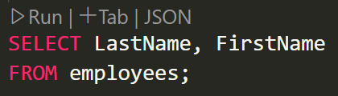

# 관계형 데이터베이스
## SQL

### SELECT
- 조회 키워드
- 필드(컬럼)를 하나 이상 지정
- `FROM` 으로 그 테이블의 이름을 지정
- 보통 문제가 employees 필드에서 Lastname 필드의 ~가 들어간 이름을 조회해라. 이런 식으로 나옴.
---

# AI
## Retrival DB 구축이란?

- 사용자가 어떤 질문이나 키워드를 입력했을 때,
그에 관련된 문서, 정보, 텍스트 등을 빠르게 찾아주는 데이터베이스를 만드는 것

### 🔧 자주 쓰는 도구들
- 📦 FAISS: Facebook에서 만든 빠른 유사도 검색 라이브러리

- 🌲 Pinecone: 클라우드 기반 벡터 DB 서비스

- 🧠 OpenAI Embedding, HuggingFace 모델 등으로 텍스트를 벡터화