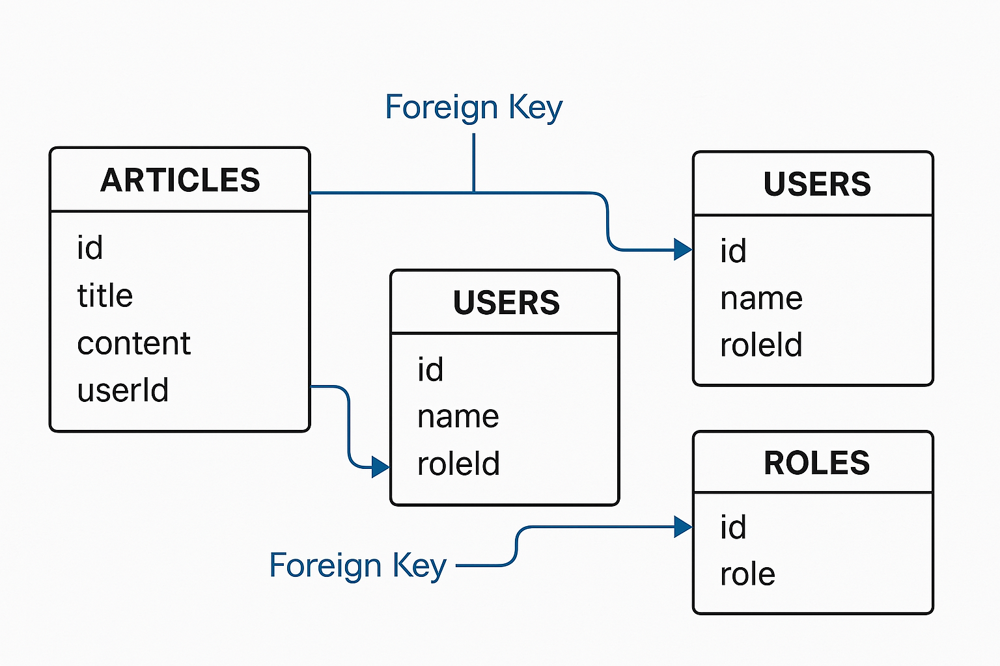
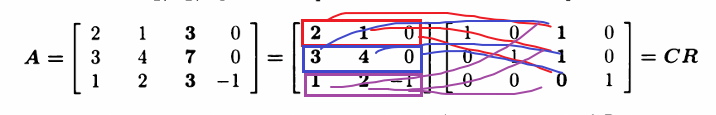

## 📰 LG전자 × 기아자동차: AI로 미래 모빌리티 공간 혁신

📌 시사점
자동차 = 이동 수단 + 생활 공간으로의 패러다임 전환
→ 차량 내 AI 기반 UX 설계는 자율주행 시대의 핵심 경쟁력으로 부상 중

AI + UX디자인 융합 역량 강화 필요성 → 단순한 기술 구현이 아니라 사용자의 라이프스타일 분석 기반의 맞춤형 공간 제안 능력이 요구됨

💡 비유적으로 보면
차량이 더 이상 단순한 "탈것(vehicle)"이 아니라, 움직이는 스마트홈(moving smart home) 으로 진화하는 흐름!

==> 내가 진짜 원했던 분야!!!!

### 🚗 모빌리티 + AI	자율주행, AI 기반 UX가 미래차 핵심 경쟁력


## 🏢 AI 강자 치트키, ‘AI 데이터센터’가 뭐길래
📌 핵심 시사점
AI의 핵심은 ‘데이터 연산 인프라’
→ AI 기술력만큼 중요한 것이 AI 데이터센터 (GPU·HPC 기반 클러스터)

네이버·카카오도 AI 데이터센터 확보 경쟁에 뛰어듦
→ 반도체·전력·냉각 인프라에 대한 투자도 병행돼야 함

💡 공부 포인트
데이터센터 = AI의 심장 (heart of AI)

AI 모델 성능은 "모델 크기 + 학습 속도 + 전력 효율성"의 함수로 결정되는데, 이 모든 것을 데이터센터가 좌우함.

## SQL2
🔑 외래 키(Foreign Key)란?
외래 키는 **다른 테이블의 값을 참조하는 열(Column)**이에요.
➜ 외부 테이블을 여는 '열쇠' 같은 역할을 해요!

🧑‍🤝‍🧑 관계(Relationship)의 종류
1️⃣ 1:N 관계 (One-to-Many)
"하나가 여러 개를 가질 수 있다"는 관계

🎯 비유:
선생님 1명(Teacher)이 여러 명의 학생(Student)을 가르칠 수 있어요.
➜ 1명의 선생님은 여러 학생과 연결됨 (1:N)

🧩 예시:
articles 테이블:
id  | title | content | userId (외래 키)
----|-------|---------|----------------
1   | 제목1 | 내용1    | 1     ← 하석주
2   | 제목2 | 내용2    | 2     ← 송윤미
3   | 제목3 | 내용3    | 3     ← 유하선

👀 여기서 userId는 users 테이블의 id를 참조

즉, `articles.userId`는 외래 키

2️⃣ N:1 관계 (Many-to-One)
위 관계를 반대로
여러 개가 하나를 가리킨다

🎯 비유:
여러 학생들이 같은 학교(School)에 다닌다면,
➜ 여러 학생이 하나의 학교와 연결됨 (N:1)

🧩 예시:

여러 게시글(articles)이 한 명의 작성자(users)를 참조함

`articles.userId` → `users.id`

✅ 왜 이렇게 나눠야 할까?

🔎 문제 상황

'하석주'라는 이름으로 검색했는데, 다른 사람도 이름이 같으면?

'하석주' 이름을 바꾸고 싶으면, 모든 글을 수정해야 함

👉 이름(name)을 고유 ID로 분리하면:

id = 1번 유저만 바꾸면 자동 적용!

정확하고 일관된 데이터 유지 가능



✅ 테이블 구조 정리:
🗂️ ARTICLES 테이블
게시글 정보를 담는 테이블

id (게시글 고유 번호)

title (제목)

content (내용)

userId (글쓴이의 id = users 테이블 참조, 외래 키!)

🧑 USERS 테이블
사용자 정보를 담는 테이블

id (사용자 고유 번호)

name (이름)

roleId (역할 정보 = roles 테이블 참조, 외래 키!)

🧩 ROLES 테이블
역할(role) 정보를 담는 테이블

id (역할 고유 번호)

role (admin, staff, student 등)

## SQL 어려운 문제들
### ws_2_5
-- 1. 부서별 최고 연령 직원, 평균연령
SELECT 
    d.name AS department,
    e.name AS oldest_employee,
    t.max_age,
    ROUND(t.avg_age, 6) AS avg_age
FROM (
    SELECT 
        departmentId,
        MAX(age) AS max_age,
        AVG(age) AS avg_age
    FROM employees
    GROUP BY departmentId
) AS t
JOIN employees e 
    ON e.departmentId = t.departmentId AND e.age = t.max_age
JOIN departments d 
    ON d.id = t.departmentId
ORDER BY d.name;


-- 2. 부서별 최고 연봉자
SELECT 
    d.name AS department,
    e.name AS highest_paid_employee,
    t.max_salary
FROM (
    SELECT 
        departmentId,
        MAX(salary) AS max_salary
    FROM employees
    GROUP BY departmentId
) AS t
JOIN employees e 
    ON e.departmentId = t.departmentId AND e.salary = t.max_salary
JOIN departments d 
    ON d.id = t.departmentId
ORDER BY d.name;


-- 3. 연령 구간별 인원 수
SELE CT 
    d.name AS department,
    CASE 
        WHEN e.age <= 30 THEN 'Under 30'
        WHEN e.age BETWEEN 31 AND 40 THEN 'Between 31-40'
        ELSE 'Over 40'
    END AS age_group,
    COUNT(*) AS num_employees
FROM employees e
JOIN departments d ON e.departmentId = d.id
GROUP BY d.name, age_group
ORDER BY d.name, age_group;


-- 4. 최고 연봉자 제외 평균 연봉
SELECT 
    d.name AS department,
    ROUND(AVG(e.salary), 2) AS avg_salary_excluding_highest
FROM employees e
JOIN departments d ON e.departmentId = d.id
WHERE e.salary < (
    SELECT MAX(e2.salary)
    FROM employees e2
    WHERE e2.departmentId = e.departmentId
)
GROUP BY d.name
ORDER BY d.name;

## ✅ JPA 핵심 요약

항목	설명

🔍 정의	자바 객체 ↔ 관계형 데이터베이스 테이블 간 매핑을 자동화해주는 ORM(Object-Relational Mapping) 기술

🧩 장점	자바 코드 기반 DB 작업 가능 → 생산성과 유지보수성 향상
비즈니스 로직과 DB 접근 로직을 분리 가능 → 가독성/재사용성 향상

⚠️ 단점	- 러닝커브 있음
- 복잡한 쿼리는 한계가 있음
- N+1 문제, 자동 SQL 생성에 대한 디버깅 어려움

🎯 적합한 경우	도메인 중심 설계, 대규모 프로젝트에서 효율적인 데이터 처리 필요 시 유용


##  A = CXR (벡터 계산법)


### 이게 어디에 쓰이느냐?

```python
import numpy as np
import pandas as pd

# 사용자 × 영화 평점 행렬 A (NaN은 아직 안 본 영화)
A = np.array([
    [5, 3, 0, 1],
    [4, 0, 0, 1],
    [1, 1, 0, 5],
    [1, 0, 0, 4],
    [0, 1, 5, 4],
])

df = pd.DataFrame(
    A, 
columns=['영화1', '영화2', '영화3', '영화4'], 
index=[f'사용자{i+1}' for i in range(5)]
)

df
```

### 차원축소(PCA)에 대한 이해
PCA는 데이터를 열공간(column space)의 축으로 투영하는 작업.

이를 이해하기 위해 알아야하는게 4개의 공간인데,
핵심 공간 (열공간, 행공간), 영공간, 좌영공간이 있다.
PCA를 하면 핵심공간에 중요한 정보를 남기고,
나머지 공간의 자료는 제거한다.

### 신경망이 진짜 표현할 수 있는 정보는?
열공간(column space) 차원.
영공간은 네트워크가 구분하지 못하는 입력 방향을 가지고 있고,
좌영공간은 손실(loss)가 작아도 학습이 안되는 이유이다.

### 결국 4개 공간의 수학적 존재 이유는 이것이다.
어떤 입력이 무효인가? -> Null Space
어떤 출력이 가능한가? -> Column Space
어떤 제약조건이 걸려 있는가? -> Row Space
