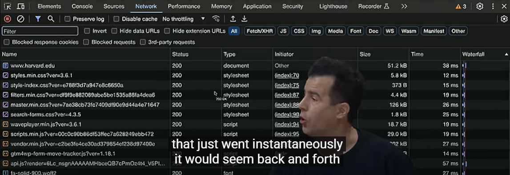
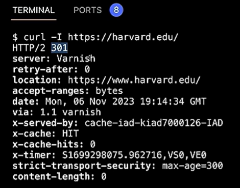
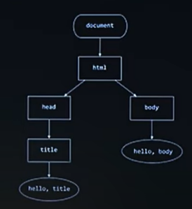

# 🌐 Web Development 기초 개념 정리

## 🧠 개발자 도구 (Developer Tools)
- `F12`를 눌러 **개발자 도구**를 열 수 있다.
- **Network 탭**에서는 **본인 노트북과 웹사이트 서버 간 HTTP 요청(Request)과 응답(Response)** 과정을 볼 수 있음.

> ✅ 네트워크 요청/응답의 흐름을 **실시간으로 추적**할 수 있어 디버깅에 매우 유용함.

### 📸 Network 탭 예시


- 각 파일의 상태, 타입, 크기, 소요 시간 등을 볼 수 있다.
- "Status: 200" 등으로 응답 상태를 확인할 수 있다.

---

## 📦 HTTP Status Codes (상태 코드)

HTTP 상태 코드는 **서버의 응답 상태**를 알려주는 숫자 코드야.  
마치 택배 상태 추적처럼, 서버가 지금 어떤 상황인지 알려주는 신호등🚦 같은 거지!

| Code | Meaning (의미) | 설명 |
|------|----------------|------|
| `200` | OK | ✅ 요청이 성공적으로 처리됨 |
| `301` | Moved Permanently | 🔁 요청한 URL이 **영구적으로 이동됨** |
| `302` | Found | 일시적 이동 (임시 리다이렉트) |
| `304` | Not Modified | 캐시된 버전 사용 가능 |
| `307` | Temporary Redirect | 요청이 **임시로 다른 곳으로** 이동됨 |
| `401` | Unauthorized | 🔒 인증 필요 (로그인해야 함) |
| `403` | Forbidden | 🚫 접근 금지 |
| `404` | Not Found | ❌ 요청한 페이지가 없음 |
| `418` | I'm a Teapot | ☕ 장난용 코드 (Easter Egg!) |
| `500` | Internal Server Error | 🧯 서버 에러 |
| `503` | Service Unavailable | 🛠 서버가 과부하 or 점검 중 |


---

## 🧪 실습: `curl` 명령어로 서버 응답 확인하기
```bash
curl -I https://harvard.edu/
```

📜 결과:


- `HTTP/2 301`: 페이지가 영구적으로 다른 주소로 이동했음을 의미함 (Redirect)
- `location:` 헤더를 통해 새로운 주소가 명시됨

---

## 🕸 HTML 구조와 파싱 (Parsing)

### 🔤 HTML 기본 예시
```html
<!DOCTYPE html>  <!-- HTML 버전 선언 -->
<html lang="en">
  <head>
    <title>hello, title</title>
  </head>
  <body>
    hello, body
  </body>
</html>
```

### 🌲 HTML Tree 구조 (DOM Tree)
HTML 코드는 **트리(Tree)** 구조로 파싱됨.  
마치 **가족 족보**처럼 부모-자식 관계로 연결되어 있어!

📌 **Parser**: 코드를 읽고 분석하는 소프트웨어

🖼 트리 구조 시각화:  


---

## 🌍 웹페이지 실행 방법 (로컬 서버 사용하기)

### 📦 `http-server` 사용법
1. VSCode 터미널에서 설치:
   ```bash
   npm install -g http-server
   ```
2. 실행:
   ```bash
   http-server
   ```
3. 브라우저 주소창에 로컬 주소 입력 (예: `http://localhost:8080`)

- `.html` 파일을 클릭하면 내가 만든 웹페이지를 직접 볼 수 있어!  
- 로컬 서버를 통해 **웹페이지 미리보기** 가능

---

## 🤔 번외: safetyschool.org가 yale.edu로 가는 이유?
- `301 Moved Permanently` 또는 도메인 리디렉션 설정 때문
- 종종 **도메인을 구매한 후 리다이렉트 설정**을 통해 다른 사이트로 연결되기도 함

---

## 🧠 핵심 요약

| 개념 | 한 줄 요약 |
|------|-------------|
| Developer Tools | 브라우저와 서버 간 통신 확인 도구 |
| Status Code | 서버의 응답 상태를 나타냄 |
| curl 명령어 | 서버의 응답 헤더 확인 가능 |
| HTML 파싱 | 코드 → 트리구조로 분석됨 |
| http-server | 로컬에서 웹페이지 실행 가능 |

# RESTful 설계
- 웹 API를 설계할 때, 리소스(자원, article_id)를 중심으로 설계 메서드(동작, create, delete)를 사용해서 동작을 명확하게 표현
1. URL 경로는 리소스를 위주로 설계 (자원, 복수형)
2. 계층적이고 의미있도록 설계

=> 가독성, 일관성, 유지보수, 표준 => 확장성, 연동하기 좋다. cf_) MCP

## CASCADE
- 참조 대상이 삭제되면=> 연결된 객체도 삭제
(게시글이 지워지면, 게시글에 작성된 댓글도 전부 지워진다.)
## PROTECT
- 참조 대상이 삭제되지 못하도록 막음
=> Django ORM(quersetAPI) 실행될때, 확인하고 막음 
## RESTRICT  
- 참조 대상이 삭제되지 못하도록 막음
=> SQL ,테이블 레벨에서 실행될 때, 확인되고 막음 
=> 댓글을 먼저 다 지워야지만, 게시글을 지울 수 있음 

# Linear Algebra
## 1.2 Lengths and Angles from Dot Products
